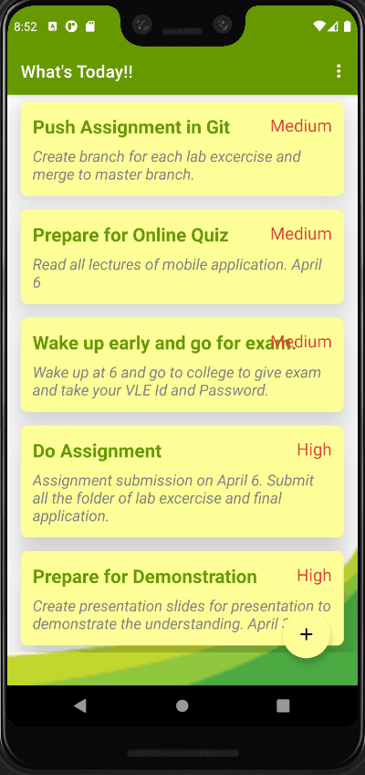

## Todo Application
A simple android application to save your daily todo tasks. User can add, update and delete daily task log.
User can divide the task into three category: High, Medium and Low Priority.

## GIF of ToDo Application
## GIF of Splash Activity

## GIF of Add/Cancel Task

## GIF of Update Task

## GIF of Swipe and Delete Task

## GIF of Empty Field Validation

## GIF of Delete All Task Functionality in Menu

## GIF of Landscape Orientation of Application

## GIF of Final Application
